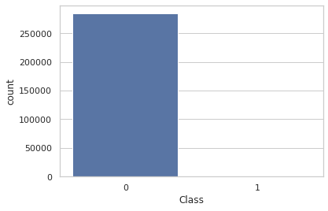

```python
import numpy as np
import pandas as pd 
import matplotlib.pyplot as plt
import seaborn as sns
```


```python
df = pd.read_csv('creditcard.csv')
df.head()
```


<div>
<style scoped>
    .dataframe tbody tr th:only-of-type {
        vertical-align: middle;
    }

    .dataframe tbody tr th {
        vertical-align: top;
    }

    .dataframe thead th {
        text-align: right;
    }
</style>
<table border="1" class="dataframe">
  <thead>
    <tr style="text-align: right;">
      <th></th>
      <th>Time</th>
      <th>V1</th>
      <th>V2</th>
      <th>V3</th>
      <th>V4</th>
      <th>V5</th>
      <th>V6</th>
      <th>V7</th>
      <th>V8</th>
      <th>V9</th>
      <th>...</th>
      <th>V21</th>
      <th>V22</th>
      <th>V23</th>
      <th>V24</th>
      <th>V25</th>
      <th>V26</th>
      <th>V27</th>
      <th>V28</th>
      <th>Amount</th>
      <th>Class</th>
    </tr>
  </thead>
  <tbody>
    <tr>
      <th>0</th>
      <td>0.0</td>
      <td>-1.359807</td>
      <td>-0.072781</td>
      <td>2.536347</td>
      <td>1.378155</td>
      <td>-0.338321</td>
      <td>0.462388</td>
      <td>0.239599</td>
      <td>0.098698</td>
      <td>0.363787</td>
      <td>...</td>
      <td>-0.018307</td>
      <td>0.277838</td>
      <td>-0.110474</td>
      <td>0.066928</td>
      <td>0.128539</td>
      <td>-0.189115</td>
      <td>0.133558</td>
      <td>-0.021053</td>
      <td>149.62</td>
      <td>0</td>
    </tr>
    <tr>
      <th>1</th>
      <td>0.0</td>
      <td>1.191857</td>
      <td>0.266151</td>
      <td>0.166480</td>
      <td>0.448154</td>
      <td>0.060018</td>
      <td>-0.082361</td>
      <td>-0.078803</td>
      <td>0.085102</td>
      <td>-0.255425</td>
      <td>...</td>
      <td>-0.225775</td>
      <td>-0.638672</td>
      <td>0.101288</td>
      <td>-0.339846</td>
      <td>0.167170</td>
      <td>0.125895</td>
      <td>-0.008983</td>
      <td>0.014724</td>
      <td>2.69</td>
      <td>0</td>
    </tr>
    <tr>
      <th>2</th>
      <td>1.0</td>
      <td>-1.358354</td>
      <td>-1.340163</td>
      <td>1.773209</td>
      <td>0.379780</td>
      <td>-0.503198</td>
      <td>1.800499</td>
      <td>0.791461</td>
      <td>0.247676</td>
      <td>-1.514654</td>
      <td>...</td>
      <td>0.247998</td>
      <td>0.771679</td>
      <td>0.909412</td>
      <td>-0.689281</td>
      <td>-0.327642</td>
      <td>-0.139097</td>
      <td>-0.055353</td>
      <td>-0.059752</td>
      <td>378.66</td>
      <td>0</td>
    </tr>
    <tr>
      <th>3</th>
      <td>1.0</td>
      <td>-0.966272</td>
      <td>-0.185226</td>
      <td>1.792993</td>
      <td>-0.863291</td>
      <td>-0.010309</td>
      <td>1.247203</td>
      <td>0.237609</td>
      <td>0.377436</td>
      <td>-1.387024</td>
      <td>...</td>
      <td>-0.108300</td>
      <td>0.005274</td>
      <td>-0.190321</td>
      <td>-1.175575</td>
      <td>0.647376</td>
      <td>-0.221929</td>
      <td>0.062723</td>
      <td>0.061458</td>
      <td>123.50</td>
      <td>0</td>
    </tr>
    <tr>
      <th>4</th>
      <td>2.0</td>
      <td>-1.158233</td>
      <td>0.877737</td>
      <td>1.548718</td>
      <td>0.403034</td>
      <td>-0.407193</td>
      <td>0.095921</td>
      <td>0.592941</td>
      <td>-0.270533</td>
      <td>0.817739</td>
      <td>...</td>
      <td>-0.009431</td>
      <td>0.798278</td>
      <td>-0.137458</td>
      <td>0.141267</td>
      <td>-0.206010</td>
      <td>0.502292</td>
      <td>0.219422</td>
      <td>0.215153</td>
      <td>69.99</td>
      <td>0</td>
    </tr>
  </tbody>
</table>
<p>5 rows × 31 columns</p>
</div>


```python
df.info()
```

    <class 'pandas.core.frame.DataFrame'>
    RangeIndex: 284807 entries, 0 to 284806
    Data columns (total 31 columns):
     #   Column  Non-Null Count   Dtype  
    ---  ------  --------------   -----  
     0   Time    284807 non-null  float64
     1   V1      284807 non-null  float64
     2   V2      284807 non-null  float64
     3   V3      284807 non-null  float64
     4   V4      284807 non-null  float64
     5   V5      284807 non-null  float64
     6   V6      284807 non-null  float64
     7   V7      284807 non-null  float64
     8   V8      284807 non-null  float64
     9   V9      284807 non-null  float64
     10  V10     284807 non-null  float64
     11  V11     284807 non-null  float64
     12  V12     284807 non-null  float64
     13  V13     284807 non-null  float64
     14  V14     284807 non-null  float64
     15  V15     284807 non-null  float64
     16  V16     284807 non-null  float64
     17  V17     284807 non-null  float64
     18  V18     284807 non-null  float64
     19  V19     284807 non-null  float64
     20  V20     284807 non-null  float64
     21  V21     284807 non-null  float64
     22  V22     284807 non-null  float64
     23  V23     284807 non-null  float64
     24  V24     284807 non-null  float64
     25  V25     284807 non-null  float64
     26  V26     284807 non-null  float64
     27  V27     284807 non-null  float64
     28  V28     284807 non-null  float64
     29  Amount  284807 non-null  float64
     30  Class   284807 non-null  int64  
    dtypes: float64(30), int64(1)
    memory usage: 67.4 MB


```python
df.describe()
```


<div>
<style scoped>
    .dataframe tbody tr th:only-of-type {
        vertical-align: middle;
    }

    .dataframe tbody tr th {
        vertical-align: top;
    }

    .dataframe thead th {
        text-align: right;
    }
</style>
<table border="1" class="dataframe">
  <thead>
    <tr style="text-align: right;">
      <th></th>
      <th>Time</th>
      <th>V1</th>
      <th>V2</th>
      <th>V3</th>
      <th>V4</th>
      <th>V5</th>
      <th>V6</th>
      <th>V7</th>
      <th>V8</th>
      <th>V9</th>
      <th>...</th>
      <th>V21</th>
      <th>V22</th>
      <th>V23</th>
      <th>V24</th>
      <th>V25</th>
      <th>V26</th>
      <th>V27</th>
      <th>V28</th>
      <th>Amount</th>
      <th>Class</th>
    </tr>
  </thead>
  <tbody>
    <tr>
      <th>count</th>
      <td>284807.000000</td>
      <td>2.848070e+05</td>
      <td>2.848070e+05</td>
      <td>2.848070e+05</td>
      <td>2.848070e+05</td>
      <td>2.848070e+05</td>
      <td>2.848070e+05</td>
      <td>2.848070e+05</td>
      <td>2.848070e+05</td>
      <td>2.848070e+05</td>
      <td>...</td>
      <td>2.848070e+05</td>
      <td>2.848070e+05</td>
      <td>2.848070e+05</td>
      <td>2.848070e+05</td>
      <td>2.848070e+05</td>
      <td>2.848070e+05</td>
      <td>2.848070e+05</td>
      <td>2.848070e+05</td>
      <td>284807.000000</td>
      <td>284807.000000</td>
    </tr>
    <tr>
      <th>mean</th>
      <td>94813.859575</td>
      <td>3.919560e-15</td>
      <td>5.688174e-16</td>
      <td>-8.769071e-15</td>
      <td>2.782312e-15</td>
      <td>-1.552563e-15</td>
      <td>2.010663e-15</td>
      <td>-1.694249e-15</td>
      <td>-1.927028e-16</td>
      <td>-3.137024e-15</td>
      <td>...</td>
      <td>1.537294e-16</td>
      <td>7.959909e-16</td>
      <td>5.367590e-16</td>
      <td>4.458112e-15</td>
      <td>1.453003e-15</td>
      <td>1.699104e-15</td>
      <td>-3.660161e-16</td>
      <td>-1.206049e-16</td>
      <td>88.349619</td>
      <td>0.001727</td>
    </tr>
    <tr>
      <th>std</th>
      <td>47488.145955</td>
      <td>1.958696e+00</td>
      <td>1.651309e+00</td>
      <td>1.516255e+00</td>
      <td>1.415869e+00</td>
      <td>1.380247e+00</td>
      <td>1.332271e+00</td>
      <td>1.237094e+00</td>
      <td>1.194353e+00</td>
      <td>1.098632e+00</td>
      <td>...</td>
      <td>7.345240e-01</td>
      <td>7.257016e-01</td>
      <td>6.244603e-01</td>
      <td>6.056471e-01</td>
      <td>5.212781e-01</td>
      <td>4.822270e-01</td>
      <td>4.036325e-01</td>
      <td>3.300833e-01</td>
      <td>250.120109</td>
      <td>0.041527</td>
    </tr>
    <tr>
      <th>min</th>
      <td>0.000000</td>
      <td>-5.640751e+01</td>
      <td>-7.271573e+01</td>
      <td>-4.832559e+01</td>
      <td>-5.683171e+00</td>
      <td>-1.137433e+02</td>
      <td>-2.616051e+01</td>
      <td>-4.355724e+01</td>
      <td>-7.321672e+01</td>
      <td>-1.343407e+01</td>
      <td>...</td>
      <td>-3.483038e+01</td>
      <td>-1.093314e+01</td>
      <td>-4.480774e+01</td>
      <td>-2.836627e+00</td>
      <td>-1.029540e+01</td>
      <td>-2.604551e+00</td>
      <td>-2.256568e+01</td>
      <td>-1.543008e+01</td>
      <td>0.000000</td>
      <td>0.000000</td>
    </tr>
    <tr>
      <th>25%</th>
      <td>54201.500000</td>
      <td>-9.203734e-01</td>
      <td>-5.985499e-01</td>
      <td>-8.903648e-01</td>
      <td>-8.486401e-01</td>
      <td>-6.915971e-01</td>
      <td>-7.682956e-01</td>
      <td>-5.540759e-01</td>
      <td>-2.086297e-01</td>
      <td>-6.430976e-01</td>
      <td>...</td>
      <td>-2.283949e-01</td>
      <td>-5.423504e-01</td>
      <td>-1.618463e-01</td>
      <td>-3.545861e-01</td>
      <td>-3.171451e-01</td>
      <td>-3.269839e-01</td>
      <td>-7.083953e-02</td>
      <td>-5.295979e-02</td>
      <td>5.600000</td>
      <td>0.000000</td>
    </tr>
    <tr>
      <th>50%</th>
      <td>84692.000000</td>
      <td>1.810880e-02</td>
      <td>6.548556e-02</td>
      <td>1.798463e-01</td>
      <td>-1.984653e-02</td>
      <td>-5.433583e-02</td>
      <td>-2.741871e-01</td>
      <td>4.010308e-02</td>
      <td>2.235804e-02</td>
      <td>-5.142873e-02</td>
      <td>...</td>
      <td>-2.945017e-02</td>
      <td>6.781943e-03</td>
      <td>-1.119293e-02</td>
      <td>4.097606e-02</td>
      <td>1.659350e-02</td>
      <td>-5.213911e-02</td>
      <td>1.342146e-03</td>
      <td>1.124383e-02</td>
      <td>22.000000</td>
      <td>0.000000</td>
    </tr>
    <tr>
      <th>75%</th>
      <td>139320.500000</td>
      <td>1.315642e+00</td>
      <td>8.037239e-01</td>
      <td>1.027196e+00</td>
      <td>7.433413e-01</td>
      <td>6.119264e-01</td>
      <td>3.985649e-01</td>
      <td>5.704361e-01</td>
      <td>3.273459e-01</td>
      <td>5.971390e-01</td>
      <td>...</td>
      <td>1.863772e-01</td>
      <td>5.285536e-01</td>
      <td>1.476421e-01</td>
      <td>4.395266e-01</td>
      <td>3.507156e-01</td>
      <td>2.409522e-01</td>
      <td>9.104512e-02</td>
      <td>7.827995e-02</td>
      <td>77.165000</td>
      <td>0.000000</td>
    </tr>
    <tr>
      <th>max</th>
      <td>172792.000000</td>
      <td>2.454930e+00</td>
      <td>2.205773e+01</td>
      <td>9.382558e+00</td>
      <td>1.687534e+01</td>
      <td>3.480167e+01</td>
      <td>7.330163e+01</td>
      <td>1.205895e+02</td>
      <td>2.000721e+01</td>
      <td>1.559499e+01</td>
      <td>...</td>
      <td>2.720284e+01</td>
      <td>1.050309e+01</td>
      <td>2.252841e+01</td>
      <td>4.584549e+00</td>
      <td>7.519589e+00</td>
      <td>3.517346e+00</td>
      <td>3.161220e+01</td>
      <td>3.384781e+01</td>
      <td>25691.160000</td>
      <td>1.000000</td>
    </tr>
  </tbody>
</table>
<p>8 rows × 31 columns</p>
</div>


```python
df.isnull().sum()
```


    Time      0
    V1        0
    V2        0
    V3        0
    V4        0
    V5        0
    V6        0
    V7        0
    V8        0
    V9        0
    V10       0
    V11       0
    V12       0
    V13       0
    V14       0
    V15       0
    V16       0
    V17       0
    V18       0
    V19       0
    V20       0
    V21       0
    V22       0
    V23       0
    V24       0
    V25       0
    V26       0
    V27       0
    V28       0
    Amount    0
    Class     0
    dtype: int64


```python
df.dropna(inplace=True)
```


```python
df.isnull().sum().any()
```


    False


```python
df.Class.value_counts()
```


    0    284315
    1       492
    Name: Class, dtype: int64


```python
df.Class.sum()/len(df.Class == 1)
```


    0.001727485630620034


```python
len(df.Class == 1)/df.Class.sum()
```


    578.8760162601626


```python
sns.set(style="whitegrid")

sns.countplot(x="Class", data = df)
plt.show()
```


    

    


```python
sns.distplot(df.Amount)
plt.xscale('log')
```


    

    


```python
sns.boxplot(x = df['Class'], y = df['Amount'])
plt.title('Amount - non-fraud - 0 VS fraudelent - 1')
plt.show()
```


    

    


```python
sns.boxplot(x = df['Class'], y = df['Amount'])
plt.title('Amount - non-fraud - 0 VS fraudelent - 1')
plt.yscale('log')
plt.show()
```


    

    


```python
sns.lineplot(x = range(len(df)), y = df['Time'])
plt.show()
```


    

    


```python
sns.distplot(df.Time)
plt.xlim([min(df.Time), max(df.Time)])
# plt.xlim(-10, 10)
```


    (0.0, 172792.0)


    

    


```python
from sklearn.model_selection import train_test_split
X = df.drop(['Class', 'Time'], axis = 1)
y= df['Class']
X_train, X_test, y_train, y_test = train_test_split(X, y,test_size = 0.25, random_state = 16, shuffle = True, stratify = y)
```


```python
dfb = df.copy()
# AS THE RATIO BETWEEN THEM IS 492 WE HAVE TO DIVIDE THE NON-FRADULENT DATASET BY 492

fraud = dfb.loc[df['Class'] == 1]
non_fraud = dfb.loc[df['Class'] == 0][:492]
```


```python
new_df = pd.concat([fraud, non_fraud])
new_df.head()
```


<div>
<style scoped>
    .dataframe tbody tr th:only-of-type {
        vertical-align: middle;
    }

    .dataframe tbody tr th {
        vertical-align: top;
    }

    .dataframe thead th {
        text-align: right;
    }
</style>
<table border="1" class="dataframe">
  <thead>
    <tr style="text-align: right;">
      <th></th>
      <th>Time</th>
      <th>V1</th>
      <th>V2</th>
      <th>V3</th>
      <th>V4</th>
      <th>V5</th>
      <th>V6</th>
      <th>V7</th>
      <th>V8</th>
      <th>V9</th>
      <th>...</th>
      <th>V21</th>
      <th>V22</th>
      <th>V23</th>
      <th>V24</th>
      <th>V25</th>
      <th>V26</th>
      <th>V27</th>
      <th>V28</th>
      <th>Amount</th>
      <th>Class</th>
    </tr>
  </thead>
  <tbody>
    <tr>
      <th>541</th>
      <td>406.0</td>
      <td>-2.312227</td>
      <td>1.951992</td>
      <td>-1.609851</td>
      <td>3.997906</td>
      <td>-0.522188</td>
      <td>-1.426545</td>
      <td>-2.537387</td>
      <td>1.391657</td>
      <td>-2.770089</td>
      <td>...</td>
      <td>0.517232</td>
      <td>-0.035049</td>
      <td>-0.465211</td>
      <td>0.320198</td>
      <td>0.044519</td>
      <td>0.177840</td>
      <td>0.261145</td>
      <td>-0.143276</td>
      <td>0.00</td>
      <td>1</td>
    </tr>
    <tr>
      <th>623</th>
      <td>472.0</td>
      <td>-3.043541</td>
      <td>-3.157307</td>
      <td>1.088463</td>
      <td>2.288644</td>
      <td>1.359805</td>
      <td>-1.064823</td>
      <td>0.325574</td>
      <td>-0.067794</td>
      <td>-0.270953</td>
      <td>...</td>
      <td>0.661696</td>
      <td>0.435477</td>
      <td>1.375966</td>
      <td>-0.293803</td>
      <td>0.279798</td>
      <td>-0.145362</td>
      <td>-0.252773</td>
      <td>0.035764</td>
      <td>529.00</td>
      <td>1</td>
    </tr>
    <tr>
      <th>4920</th>
      <td>4462.0</td>
      <td>-2.303350</td>
      <td>1.759247</td>
      <td>-0.359745</td>
      <td>2.330243</td>
      <td>-0.821628</td>
      <td>-0.075788</td>
      <td>0.562320</td>
      <td>-0.399147</td>
      <td>-0.238253</td>
      <td>...</td>
      <td>-0.294166</td>
      <td>-0.932391</td>
      <td>0.172726</td>
      <td>-0.087330</td>
      <td>-0.156114</td>
      <td>-0.542628</td>
      <td>0.039566</td>
      <td>-0.153029</td>
      <td>239.93</td>
      <td>1</td>
    </tr>
    <tr>
      <th>6108</th>
      <td>6986.0</td>
      <td>-4.397974</td>
      <td>1.358367</td>
      <td>-2.592844</td>
      <td>2.679787</td>
      <td>-1.128131</td>
      <td>-1.706536</td>
      <td>-3.496197</td>
      <td>-0.248778</td>
      <td>-0.247768</td>
      <td>...</td>
      <td>0.573574</td>
      <td>0.176968</td>
      <td>-0.436207</td>
      <td>-0.053502</td>
      <td>0.252405</td>
      <td>-0.657488</td>
      <td>-0.827136</td>
      <td>0.849573</td>
      <td>59.00</td>
      <td>1</td>
    </tr>
    <tr>
      <th>6329</th>
      <td>7519.0</td>
      <td>1.234235</td>
      <td>3.019740</td>
      <td>-4.304597</td>
      <td>4.732795</td>
      <td>3.624201</td>
      <td>-1.357746</td>
      <td>1.713445</td>
      <td>-0.496358</td>
      <td>-1.282858</td>
      <td>...</td>
      <td>-0.379068</td>
      <td>-0.704181</td>
      <td>-0.656805</td>
      <td>-1.632653</td>
      <td>1.488901</td>
      <td>0.566797</td>
      <td>-0.010016</td>
      <td>0.146793</td>
      <td>1.00</td>
      <td>1</td>
    </tr>
  </tbody>
</table>
<p>5 rows × 31 columns</p>
</div>


```python
sns.countplot('Class', data=new_df)
```


    <matplotlib.axes._subplots.AxesSubplot at 0x7fd5e479eb50>


    

    


```python
corr = df.corr()
sns.heatmap(corr,cmap='BrBG',)
```


    <matplotlib.axes._subplots.AxesSubplot at 0x7fd5e62bfd90>


    

    


```python
under_corr = new_df.corr()
sns.heatmap(under_corr,cmap='BrBG',)
```


    <matplotlib.axes._subplots.AxesSubplot at 0x7fd5e47bdf70>


    

    


```python
df['Amount'].hist(by=df['Class'])
```


    array([<matplotlib.axes._subplots.AxesSubplot object at 0x7fd5e624f880>,
           <matplotlib.axes._subplots.AxesSubplot object at 0x7fd5d56b1a60>],
          dtype=object)


    

    


```python
df.hist(figsize=(15,15))
plt.show()
```


    

    


```python
from sklearn.model_selection import train_test_split

x = df[['Time', 'V1', 'V2', 'V3', 'V4', 'V5', 'V6', 'V7', 'V8', 'V9', 'V10',
       'V11', 'V12', 'V13', 'V14', 'V15', 'V16', 'V17', 'V18', 'V19', 'V20',
       'V21', 'V22', 'V23', 'V24', 'V25', 'V26', 'V27', 'V28', 'Amount']]
y = df['Class']

xtrain, xtest, ytrain, ytest = train_test_split(x, y, test_size=0.30, random_state=0)
print('xtrain shape')
print(xtrain.shape)
print('xtest shape')
print(xtest.shape)
```

    xtrain shape
    (199364, 30)
    xtest shape
    (85443, 30)


```python
from sklearn.ensemble import RandomForestClassifier
from sklearn import metrics

rfmodel = RandomForestClassifier()
rfmodel.fit(xtrain,ytrain)
print(rfmodel)

```

    RandomForestClassifier()


```python
ypredrf = rfmodel.predict(xtest)
print('confusion matrix')
print(metrics.confusion_matrix(ytest, ypredrf))
print('classification report')
print(metrics.classification_report(ytest, ypredrf))
print('Accuracy : %f' % (metrics.accuracy_score(ytest, ypredrf)))
print('Area under the curve : %f' % (metrics.roc_auc_score(ytest, ypredrf)))

```

    confusion matrix
    [[85291     5]
     [   37   110]]
    classification report
                  precision    recall  f1-score   support
    
               0       1.00      1.00      1.00     85296
               1       0.96      0.75      0.84       147
    
        accuracy                           1.00     85443
       macro avg       0.98      0.87      0.92     85443
    weighted avg       1.00      1.00      1.00     85443
    
    Accuracy : 0.999508
    Area under the curve : 0.874120


```python
from sklearn import ensemble

params = {'n_estimators': 500, 'max_depth': 3, 'subsample': 0.5,
          'learning_rate': 0.01, 'min_samples_leaf': 1, 'random_state': 3}
clf = ensemble.GradientBoostingClassifier(**params)
clf.fit(xtrain, ytrain) #trains
y_pred = clf.predict(xtest)  #predicts
print('confusion matrix')
print(metrics.confusion_matrix(ytest, y_pred))
print('classification report')
print(metrics.classification_report(ytest, y_pred))
print("-----------------------------------------------------------------------------------------")
print("Accuracy is :")
print(metrics.accuracy_score(ytest, y_pred))
print('Area under the curve : %f' % (metrics.roc_auc_score(ytest, y_pred)))

```

    confusion matrix
    [[85280    16]
     [   39   108]]
    classification report
                  precision    recall  f1-score   support
    
               0       1.00      1.00      1.00     85296
               1       0.87      0.73      0.80       147
    
        accuracy                           1.00     85443
       macro avg       0.94      0.87      0.90     85443
    weighted avg       1.00      1.00      1.00     85443
    
    -----------------------------------------------------------------------------------------
    Accuracy is :
    0.9993562960102056
    Area under the curve : 0.867253


```python
from xgboost import XGBClassifier
xgb_model = XGBClassifier()
```


```python
print(xgb_model.get_xgb_params())
```

    {'objective': 'binary:logistic', 'base_score': None, 'booster': None, 'colsample_bylevel': None, 'colsample_bynode': None, 'colsample_bytree': None, 'gamma': None, 'gpu_id': None, 'interaction_constraints': None, 'learning_rate': None, 'max_delta_step': None, 'max_depth': None, 'min_child_weight': None, 'monotone_constraints': None, 'n_jobs': None, 'num_parallel_tree': None, 'random_state': None, 'reg_alpha': None, 'reg_lambda': None, 'scale_pos_weight': None, 'subsample': None, 'tree_method': None, 'validate_parameters': None, 'verbosity': None}


```python
xgb_model.fit(xtrain, ytrain, eval_metric=['error'], eval_set=[((xtrain, ytrain)),(xtest, ytest)])

```

    [0]	validation_0-error:0.00036	validation_1-error:0.00054
    [1]	validation_0-error:0.00037	validation_1-error:0.00061
    [2]	validation_0-error:0.00032	validation_1-error:0.00054
    [3]	validation_0-error:0.00031	validation_1-error:0.00052
    [4]	validation_0-error:0.00030	validation_1-error:0.00052
    [5]	validation_0-error:0.00029	validation_1-error:0.00050
    [6]	validation_0-error:0.00029	validation_1-error:0.00049
    [7]	validation_0-error:0.00028	validation_1-error:0.00049
    [8]	validation_0-error:0.00028	validation_1-error:0.00049
    [9]	validation_0-error:0.00027	validation_1-error:0.00048
    [10]	validation_0-error:0.00027	validation_1-error:0.00047
    [11]	validation_0-error:0.00026	validation_1-error:0.00048
    [12]	validation_0-error:0.00026	validation_1-error:0.00047
    [13]	validation_0-error:0.00026	validation_1-error:0.00047
    [14]	validation_0-error:0.00026	validation_1-error:0.00049
    [15]	validation_0-error:0.00026	validation_1-error:0.00050
    [16]	validation_0-error:0.00025	validation_1-error:0.00050
    [17]	validation_0-error:0.00024	validation_1-error:0.00050
    [18]	validation_0-error:0.00024	validation_1-error:0.00048
    [19]	validation_0-error:0.00024	validation_1-error:0.00049
    [20]	validation_0-error:0.00023	validation_1-error:0.00049
    [21]	validation_0-error:0.00023	validation_1-error:0.00048
    [22]	validation_0-error:0.00022	validation_1-error:0.00049
    [23]	validation_0-error:0.00022	validation_1-error:0.00049
    [24]	validation_0-error:0.00020	validation_1-error:0.00049
    [25]	validation_0-error:0.00017	validation_1-error:0.00047
    [26]	validation_0-error:0.00017	validation_1-error:0.00047
    [27]	validation_0-error:0.00015	validation_1-error:0.00048
    [28]	validation_0-error:0.00013	validation_1-error:0.00047
    [29]	validation_0-error:0.00012	validation_1-error:0.00047
    [30]	validation_0-error:0.00012	validation_1-error:0.00047
    [31]	validation_0-error:0.00012	validation_1-error:0.00047
    [32]	validation_0-error:0.00010	validation_1-error:0.00047
    [33]	validation_0-error:0.00009	validation_1-error:0.00047
    [34]	validation_0-error:0.00009	validation_1-error:0.00048
    [35]	validation_0-error:0.00008	validation_1-error:0.00046
    [36]	validation_0-error:0.00006	validation_1-error:0.00048
    [37]	validation_0-error:0.00006	validation_1-error:0.00047
    [38]	validation_0-error:0.00006	validation_1-error:0.00047
    [39]	validation_0-error:0.00006	validation_1-error:0.00046
    [40]	validation_0-error:0.00004	validation_1-error:0.00044
    [41]	validation_0-error:0.00003	validation_1-error:0.00044
    [42]	validation_0-error:0.00003	validation_1-error:0.00044
    [43]	validation_0-error:0.00003	validation_1-error:0.00044
    [44]	validation_0-error:0.00003	validation_1-error:0.00044
    [45]	validation_0-error:0.00003	validation_1-error:0.00044
    [46]	validation_0-error:0.00001	validation_1-error:0.00044
    [47]	validation_0-error:0.00001	validation_1-error:0.00047
    [48]	validation_0-error:0.00001	validation_1-error:0.00047
    [49]	validation_0-error:0.00001	validation_1-error:0.00046
    [50]	validation_0-error:0.00001	validation_1-error:0.00047
    [51]	validation_0-error:0.00001	validation_1-error:0.00047
    [52]	validation_0-error:0.00001	validation_1-error:0.00047
    [53]	validation_0-error:0.00000	validation_1-error:0.00047
    [54]	validation_0-error:0.00000	validation_1-error:0.00047
    [55]	validation_0-error:0.00000	validation_1-error:0.00047
    [56]	validation_0-error:0.00000	validation_1-error:0.00047
    [57]	validation_0-error:0.00000	validation_1-error:0.00048
    [58]	validation_0-error:0.00000	validation_1-error:0.00046
    [59]	validation_0-error:0.00000	validation_1-error:0.00044
    [60]	validation_0-error:0.00000	validation_1-error:0.00044
    [61]	validation_0-error:0.00000	validation_1-error:0.00044
    [62]	validation_0-error:0.00000	validation_1-error:0.00044
    [63]	validation_0-error:0.00000	validation_1-error:0.00043
    [64]	validation_0-error:0.00000	validation_1-error:0.00046
    [65]	validation_0-error:0.00000	validation_1-error:0.00044
    [66]	validation_0-error:0.00000	validation_1-error:0.00044
    [67]	validation_0-error:0.00000	validation_1-error:0.00047
    [68]	validation_0-error:0.00000	validation_1-error:0.00046
    [69]	validation_0-error:0.00000	validation_1-error:0.00046
    [70]	validation_0-error:0.00000	validation_1-error:0.00044
    [71]	validation_0-error:0.00000	validation_1-error:0.00043
    [72]	validation_0-error:0.00000	validation_1-error:0.00044
    [73]	validation_0-error:0.00000	validation_1-error:0.00044
    [74]	validation_0-error:0.00000	validation_1-error:0.00044
    [75]	validation_0-error:0.00000	validation_1-error:0.00044
    [76]	validation_0-error:0.00000	validation_1-error:0.00044
    [77]	validation_0-error:0.00000	validation_1-error:0.00043
    [78]	validation_0-error:0.00000	validation_1-error:0.00044
    [79]	validation_0-error:0.00000	validation_1-error:0.00044
    [80]	validation_0-error:0.00000	validation_1-error:0.00043
    [81]	validation_0-error:0.00000	validation_1-error:0.00043
    [82]	validation_0-error:0.00000	validation_1-error:0.00043
    [83]	validation_0-error:0.00000	validation_1-error:0.00043
    [84]	validation_0-error:0.00000	validation_1-error:0.00044
    [85]	validation_0-error:0.00000	validation_1-error:0.00044
    [86]	validation_0-error:0.00000	validation_1-error:0.00044
    [87]	validation_0-error:0.00000	validation_1-error:0.00044
    [88]	validation_0-error:0.00000	validation_1-error:0.00044
    [89]	validation_0-error:0.00000	validation_1-error:0.00044
    [90]	validation_0-error:0.00000	validation_1-error:0.00044
    [91]	validation_0-error:0.00000	validation_1-error:0.00044
    [92]	validation_0-error:0.00000	validation_1-error:0.00044
    [93]	validation_0-error:0.00000	validation_1-error:0.00044
    [94]	validation_0-error:0.00000	validation_1-error:0.00044
    [95]	validation_0-error:0.00000	validation_1-error:0.00044
    [96]	validation_0-error:0.00000	validation_1-error:0.00044
    [97]	validation_0-error:0.00000	validation_1-error:0.00044
    [98]	validation_0-error:0.00000	validation_1-error:0.00044
    [99]	validation_0-error:0.00000	validation_1-error:0.00046


    XGBClassifier(base_score=0.5, booster='gbtree', colsample_bylevel=1,
                  colsample_bynode=1, colsample_bytree=1, gamma=0, gpu_id=-1,
                  importance_type='gain', interaction_constraints='',
                  learning_rate=0.300000012, max_delta_step=0, max_depth=6,
                  min_child_weight=1, missing=nan, monotone_constraints='()',
                  n_estimators=100, n_jobs=0, num_parallel_tree=1, random_state=0,
                  reg_alpha=0, reg_lambda=1, scale_pos_weight=1, subsample=1,
                  tree_method='exact', validate_parameters=1, verbosity=None)


```python
from sklearn import metrics
import warnings
warnings.filterwarnings("ignore")

y_pred = xgb_model.predict(xtest)  #predicts
print('confusion matrix')
print(metrics.confusion_matrix(ytest, y_pred))
print('classification report')
print(metrics.classification_report(ytest, y_pred))
print("-----------------------------------------------------------------------------------------")
print("Accuracy is :")
print(metrics.accuracy_score(ytest, y_pred))
print('Area under the curve : %f' % (metrics.roc_auc_score(ytest, y_pred)))
```

    confusion matrix
    [[85291     5]
     [   34   113]]
    classification report
                  precision    recall  f1-score   support
    
               0       1.00      1.00      1.00     85296
               1       0.96      0.77      0.85       147
    
        accuracy                           1.00     85443
       macro avg       0.98      0.88      0.93     85443
    weighted avg       1.00      1.00      1.00     85443
    
    -----------------------------------------------------------------------------------------
    Accuracy is :
    0.9995435553526912
    Area under the curve : 0.884324


```python
from matplotlib import pyplot
xgimportance = xgb_model.feature_importances_
# summarize feature importance
for i,v in enumerate(xgimportance):
	print('Feature: %0d, Score: %.5f' %(i,v))
# plot feature importance
pyplot.bar([x for x in range(len(xgimportance))], xgimportance)
pyplot.show()
```

    Feature: 0, Score: 0.01468
    Feature: 1, Score: 0.01757
    Feature: 2, Score: 0.00976
    Feature: 3, Score: 0.01223
    Feature: 4, Score: 0.02764
    Feature: 5, Score: 0.01080
    Feature: 6, Score: 0.01184
    Feature: 7, Score: 0.02563
    Feature: 8, Score: 0.01838
    Feature: 9, Score: 0.02432
    Feature: 10, Score: 0.04842
    Feature: 11, Score: 0.01531
    Feature: 12, Score: 0.02217
    Feature: 13, Score: 0.02264
    Feature: 14, Score: 0.05721
    Feature: 15, Score: 0.01171
    Feature: 16, Score: 0.01252
    Feature: 17, Score: 0.41274
    Feature: 18, Score: 0.01819
    Feature: 19, Score: 0.01207
    Feature: 20, Score: 0.01390
    Feature: 21, Score: 0.02192
    Feature: 22, Score: 0.01195
    Feature: 23, Score: 0.01209
    Feature: 24, Score: 0.01910
    Feature: 25, Score: 0.01543
    Feature: 26, Score: 0.02921
    Feature: 27, Score: 0.02957
    Feature: 28, Score: 0.01996
    Feature: 29, Score: 0.02105


    

    


```python
# new_df
```


```python
x = new_df[['Time', 'V1', 'V2', 'V3', 'V4', 'V5', 'V6', 'V7', 'V8', 'V9', 'V10',
       'V11', 'V12', 'V13', 'V14', 'V15', 'V16', 'V17', 'V18', 'V19', 'V20',
       'V21', 'V22', 'V23', 'V24', 'V25', 'V26', 'V27', 'V28', 'Amount']]
y = new_df['Class']

xtrain, xtest, ytrain, ytest = train_test_split(x, y, test_size=0.30, random_state=0)
print('xtrain shape')
print(xtrain.shape)
print('xtest shape')
print(xtest.shape)
```

    xtrain shape
    (688, 30)
    xtest shape
    (296, 30)


```python
rfmodeln = RandomForestClassifier()
rfmodeln.fit(xtrain,ytrain)
print(rfmodeln)
```

    RandomForestClassifier()


```python
ypredrfn = rfmodeln.predict(xtest)
print('confusion matrix')
print(metrics.confusion_matrix(ytest, ypredrfn))
print('classification report')
print(metrics.classification_report(ytest, ypredrfn))
print('Accuracy : %f' % (metrics.accuracy_score(ytest, ypredrfn)))
print('Area under the curve : %f' % (metrics.roc_auc_score(ytest, ypredrfn)))
```

    confusion matrix
    [[149   0]
     [  1 146]]
    classification report
                  precision    recall  f1-score   support
    
               0       0.99      1.00      1.00       149
               1       1.00      0.99      1.00       147
    
        accuracy                           1.00       296
       macro avg       1.00      1.00      1.00       296
    weighted avg       1.00      1.00      1.00       296
    
    Accuracy : 0.996622
    Area under the curve : 0.996599


```python
#GradientBoostingClassifier
params = {'n_estimators': 500, 'max_depth': 3, 'subsample': 0.5,
          'learning_rate': 0.01, 'min_samples_leaf': 1, 'random_state': 3}
clfn = ensemble.GradientBoostingClassifier(**params)
clfn.fit(xtrain, ytrain) #trains
y_predn = clfn.predict(xtest)  #predicts
print('confusion matrix')
print(metrics.confusion_matrix(ytest, y_predn))
print('classification report')
print(metrics.classification_report(ytest, y_predn))
print("-----------------------------------------------------------------------------------------")
print("Accuracy is :")
print(metrics.accuracy_score(ytest, y_predn))
print('Area under the curve : %f' % (metrics.roc_auc_score(ytest, y_predn)))
```

    confusion matrix
    [[149   0]
     [  0 147]]
    classification report
                  precision    recall  f1-score   support
    
               0       1.00      1.00      1.00       149
               1       1.00      1.00      1.00       147
    
        accuracy                           1.00       296
       macro avg       1.00      1.00      1.00       296
    weighted avg       1.00      1.00      1.00       296
    
    -----------------------------------------------------------------------------------------
    Accuracy is :
    1.0
    Area under the curve : 1.000000


```python
xgb_modeln = XGBClassifier()
```


```python
print(xgb_modeln.get_xgb_params())
```

    {'objective': 'binary:logistic', 'base_score': None, 'booster': None, 'colsample_bylevel': None, 'colsample_bynode': None, 'colsample_bytree': None, 'gamma': None, 'gpu_id': None, 'interaction_constraints': None, 'learning_rate': None, 'max_delta_step': None, 'max_depth': None, 'min_child_weight': None, 'monotone_constraints': None, 'n_jobs': None, 'num_parallel_tree': None, 'random_state': None, 'reg_alpha': None, 'reg_lambda': None, 'scale_pos_weight': None, 'subsample': None, 'tree_method': None, 'validate_parameters': None, 'verbosity': None}


```python
xgb_modeln.fit(xtrain, ytrain, eval_metric=['error'], eval_set=[((xtrain, ytrain)),(xtest, ytest)])

```

    [0]	validation_0-error:0.00000	validation_1-error:0.00000
    [1]	validation_0-error:0.00000	validation_1-error:0.00000
    [2]	validation_0-error:0.00000	validation_1-error:0.00000
    [3]	validation_0-error:0.00000	validation_1-error:0.00000
    [4]	validation_0-error:0.00000	validation_1-error:0.00000
    [5]	validation_0-error:0.00000	validation_1-error:0.00000
    [6]	validation_0-error:0.00000	validation_1-error:0.00000
    [7]	validation_0-error:0.00000	validation_1-error:0.00000
    [8]	validation_0-error:0.00000	validation_1-error:0.00000
    [9]	validation_0-error:0.00000	validation_1-error:0.00000
    [10]	validation_0-error:0.00000	validation_1-error:0.00000
    [11]	validation_0-error:0.00000	validation_1-error:0.00000
    [12]	validation_0-error:0.00000	validation_1-error:0.00000
    [13]	validation_0-error:0.00000	validation_1-error:0.00000
    [14]	validation_0-error:0.00000	validation_1-error:0.00000
    [15]	validation_0-error:0.00000	validation_1-error:0.00000
    [16]	validation_0-error:0.00000	validation_1-error:0.00000
    [17]	validation_0-error:0.00000	validation_1-error:0.00000
    [18]	validation_0-error:0.00000	validation_1-error:0.00000
    [19]	validation_0-error:0.00000	validation_1-error:0.00000
    [20]	validation_0-error:0.00000	validation_1-error:0.00000
    [21]	validation_0-error:0.00000	validation_1-error:0.00000
    [22]	validation_0-error:0.00000	validation_1-error:0.00000
    [23]	validation_0-error:0.00000	validation_1-error:0.00000
    [24]	validation_0-error:0.00000	validation_1-error:0.00000
    [25]	validation_0-error:0.00000	validation_1-error:0.00000
    [26]	validation_0-error:0.00000	validation_1-error:0.00000
    [27]	validation_0-error:0.00000	validation_1-error:0.00000
    [28]	validation_0-error:0.00000	validation_1-error:0.00000
    [29]	validation_0-error:0.00000	validation_1-error:0.00000
    [30]	validation_0-error:0.00000	validation_1-error:0.00000
    [31]	validation_0-error:0.00000	validation_1-error:0.00000
    [32]	validation_0-error:0.00000	validation_1-error:0.00000
    [33]	validation_0-error:0.00000	validation_1-error:0.00000
    [34]	validation_0-error:0.00000	validation_1-error:0.00000
    [35]	validation_0-error:0.00000	validation_1-error:0.00000
    [36]	validation_0-error:0.00000	validation_1-error:0.00000
    [37]	validation_0-error:0.00000	validation_1-error:0.00000
    [38]	validation_0-error:0.00000	validation_1-error:0.00000
    [39]	validation_0-error:0.00000	validation_1-error:0.00000
    [40]	validation_0-error:0.00000	validation_1-error:0.00000
    [41]	validation_0-error:0.00000	validation_1-error:0.00000
    [42]	validation_0-error:0.00000	validation_1-error:0.00000
    [43]	validation_0-error:0.00000	validation_1-error:0.00000
    [44]	validation_0-error:0.00000	validation_1-error:0.00000
    [45]	validation_0-error:0.00000	validation_1-error:0.00000
    [46]	validation_0-error:0.00000	validation_1-error:0.00000
    [47]	validation_0-error:0.00000	validation_1-error:0.00000
    [48]	validation_0-error:0.00000	validation_1-error:0.00000
    [49]	validation_0-error:0.00000	validation_1-error:0.00000
    [50]	validation_0-error:0.00000	validation_1-error:0.00000
    [51]	validation_0-error:0.00000	validation_1-error:0.00000
    [52]	validation_0-error:0.00000	validation_1-error:0.00000
    [53]	validation_0-error:0.00000	validation_1-error:0.00000
    [54]	validation_0-error:0.00000	validation_1-error:0.00000
    [55]	validation_0-error:0.00000	validation_1-error:0.00000
    [56]	validation_0-error:0.00000	validation_1-error:0.00000
    [57]	validation_0-error:0.00000	validation_1-error:0.00000
    [58]	validation_0-error:0.00000	validation_1-error:0.00000
    [59]	validation_0-error:0.00000	validation_1-error:0.00000
    [60]	validation_0-error:0.00000	validation_1-error:0.00000
    [61]	validation_0-error:0.00000	validation_1-error:0.00000
    [62]	validation_0-error:0.00000	validation_1-error:0.00000
    [63]	validation_0-error:0.00000	validation_1-error:0.00000
    [64]	validation_0-error:0.00000	validation_1-error:0.00000
    [65]	validation_0-error:0.00000	validation_1-error:0.00000
    [66]	validation_0-error:0.00000	validation_1-error:0.00000
    [67]	validation_0-error:0.00000	validation_1-error:0.00000
    [68]	validation_0-error:0.00000	validation_1-error:0.00000
    [69]	validation_0-error:0.00000	validation_1-error:0.00000
    [70]	validation_0-error:0.00000	validation_1-error:0.00000
    [71]	validation_0-error:0.00000	validation_1-error:0.00000
    [72]	validation_0-error:0.00000	validation_1-error:0.00000
    [73]	validation_0-error:0.00000	validation_1-error:0.00000
    [74]	validation_0-error:0.00000	validation_1-error:0.00000
    [75]	validation_0-error:0.00000	validation_1-error:0.00000
    [76]	validation_0-error:0.00000	validation_1-error:0.00000
    [77]	validation_0-error:0.00000	validation_1-error:0.00000
    [78]	validation_0-error:0.00000	validation_1-error:0.00000
    [79]	validation_0-error:0.00000	validation_1-error:0.00000
    [80]	validation_0-error:0.00000	validation_1-error:0.00000
    [81]	validation_0-error:0.00000	validation_1-error:0.00000
    [82]	validation_0-error:0.00000	validation_1-error:0.00000
    [83]	validation_0-error:0.00000	validation_1-error:0.00000
    [84]	validation_0-error:0.00000	validation_1-error:0.00000
    [85]	validation_0-error:0.00000	validation_1-error:0.00000
    [86]	validation_0-error:0.00000	validation_1-error:0.00000
    [87]	validation_0-error:0.00000	validation_1-error:0.00000
    [88]	validation_0-error:0.00000	validation_1-error:0.00000
    [89]	validation_0-error:0.00000	validation_1-error:0.00000
    [90]	validation_0-error:0.00000	validation_1-error:0.00000
    [91]	validation_0-error:0.00000	validation_1-error:0.00000
    [92]	validation_0-error:0.00000	validation_1-error:0.00000
    [93]	validation_0-error:0.00000	validation_1-error:0.00000
    [94]	validation_0-error:0.00000	validation_1-error:0.00000
    [95]	validation_0-error:0.00000	validation_1-error:0.00000
    [96]	validation_0-error:0.00000	validation_1-error:0.00000
    [97]	validation_0-error:0.00000	validation_1-error:0.00000
    [98]	validation_0-error:0.00000	validation_1-error:0.00000
    [99]	validation_0-error:0.00000	validation_1-error:0.00000


    XGBClassifier(base_score=0.5, booster='gbtree', colsample_bylevel=1,
                  colsample_bynode=1, colsample_bytree=1, gamma=0, gpu_id=-1,
                  importance_type='gain', interaction_constraints='',
                  learning_rate=0.300000012, max_delta_step=0, max_depth=6,
                  min_child_weight=1, missing=nan, monotone_constraints='()',
                  n_estimators=100, n_jobs=0, num_parallel_tree=1, random_state=0,
                  reg_alpha=0, reg_lambda=1, scale_pos_weight=1, subsample=1,
                  tree_method='exact', validate_parameters=1, verbosity=None)


```python
y_predn = xgb_modeln.predict(xtest)  #predicts
print('confusion matrix')
print(metrics.confusion_matrix(ytest, y_predn))
print('classification report')
print(metrics.classification_report(ytest, y_predn))
print("-----------------------------------------------------------------------------------------")
print("Accuracy is :")
print(metrics.accuracy_score(ytest, y_predn))
print('Area under the curve : %f' % (metrics.roc_auc_score(ytest, y_predn)))
```

    confusion matrix
    [[149   0]
     [  0 147]]
    classification report
                  precision    recall  f1-score   support
    
               0       1.00      1.00      1.00       149
               1       1.00      1.00      1.00       147
    
        accuracy                           1.00       296
       macro avg       1.00      1.00      1.00       296
    weighted avg       1.00      1.00      1.00       296
    
    -----------------------------------------------------------------------------------------
    Accuracy is :
    1.0
    Area under the curve : 1.000000


```python
xgimportancen = xgb_modeln.feature_importances_
# summarize feature importance
for i,v in enumerate(xgimportancen):
	print('Feature: %0d, Score: %.5f' % (i,v))
# plot feature importance
pyplot.bar([x for x in range(len(xgimportancen))], xgimportancen)
pyplot.show()
```

    Feature: 0, Score: 1.00000
    Feature: 1, Score: 0.00000
    Feature: 2, Score: 0.00000
    Feature: 3, Score: 0.00000
    Feature: 4, Score: 0.00000
    Feature: 5, Score: 0.00000
    Feature: 6, Score: 0.00000
    Feature: 7, Score: 0.00000
    Feature: 8, Score: 0.00000
    Feature: 9, Score: 0.00000
    Feature: 10, Score: 0.00000
    Feature: 11, Score: 0.00000
    Feature: 12, Score: 0.00000
    Feature: 13, Score: 0.00000
    Feature: 14, Score: 0.00000
    Feature: 15, Score: 0.00000
    Feature: 16, Score: 0.00000
    Feature: 17, Score: 0.00000
    Feature: 18, Score: 0.00000
    Feature: 19, Score: 0.00000
    Feature: 20, Score: 0.00000
    Feature: 21, Score: 0.00000
    Feature: 22, Score: 0.00000
    Feature: 23, Score: 0.00000
    Feature: 24, Score: 0.00000
    Feature: 25, Score: 0.00000
    Feature: 26, Score: 0.00000
    Feature: 27, Score: 0.00000
    Feature: 28, Score: 0.00000
    Feature: 29, Score: 0.00000


    

    


```python

```


```python

```


```python

```


```python

```


```python

```


```python

```


```python

```


```python

```


```python

```
